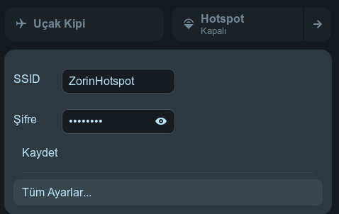
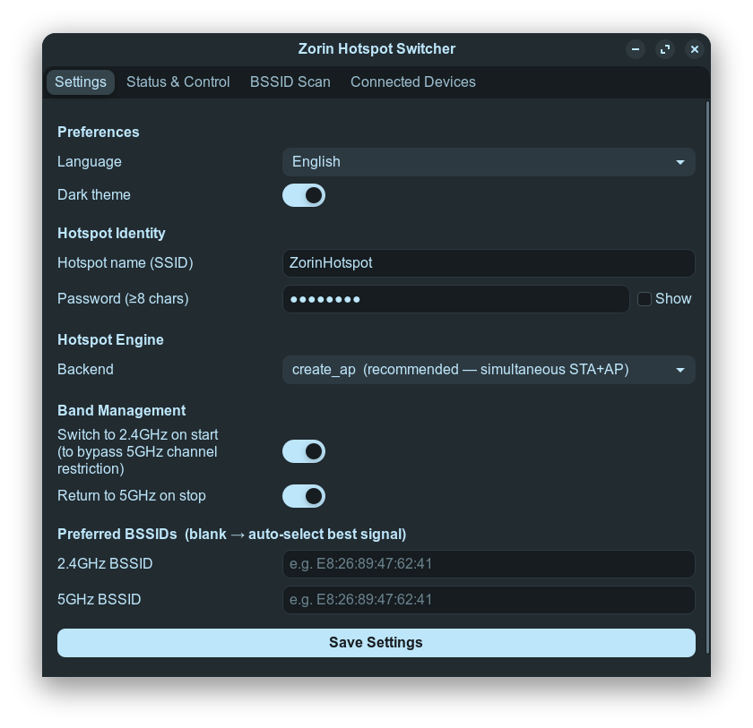
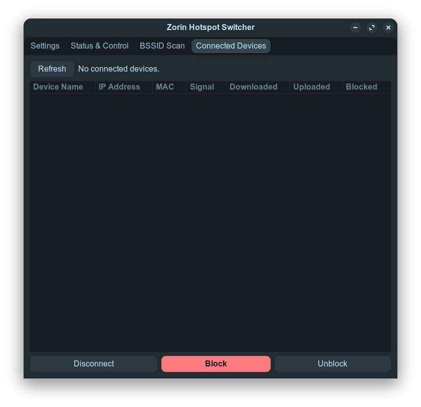
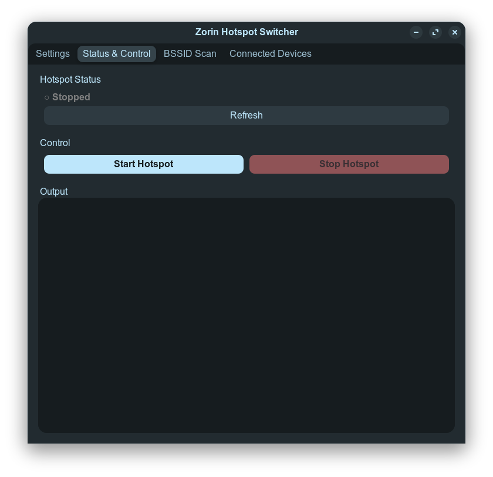

# Zorin Hotspot Switcher

**Turn your Linux machine into a WiFi hotspot while staying connected to any network — all on a single WiFi card.**

> 🇹🇷 [Türkçe README için tıklayın](README_TR.md)

[](https://github.com/aliafacan/zorin-hopspot-switcher/releases/tag/v1.0.0)
[](LICENSE)
[](https://extensions.gnome.org)
[](https://zoringroup.com)
[](https://python.org)

---

## Screenshots

| GNOME Quick Settings | Settings App (Dark) |
|:---:|:---:|
|  |  |

| Connected Devices | Status & Control |
|:---:|:---:|
|  |  |

---

## Features

### GNOME Quick Settings Panel
- **One-click toggle** directly in the system tray (no app needed)
- **Inline SSID & password editing** — change credentials without opening the full app
- **Live status subtitle** — shows "On — YourSSID" or "Off"
- Eye icon to reveal/hide password

### GTK Settings App
- **4 tabs:** Settings · Status & Control · BSSID Scan · Connected Devices
- **Dark / Light theme** toggle (applies instantly, saved to preferences)
- **Turkish / English** language switch (rebuilt UI, no restart needed)
- **Backend selection:** `create_ap` (recommended) or `nmcli hotspot`
- **Band management:** auto-switch to 2.4 GHz on start, return to 5 GHz on stop
- **BSSID scanner:** scan nearby networks, double-click to copy preferred BSSID

### Connected Device Management
- View connected clients: hostname, IP, MAC, signal, TX/RX bytes
- **Kick** — temporarily disconnect a client
- **Block** — disconnect + iptables DROP (persists across hotspot restarts)
- **Unblock** — remove iptables rule from the permanent blocklist
- Auto-refresh every 10 seconds

### Backend & System
- Non-blocking async subprocess calls (GNOME Shell stays responsive)
- Polling timer pauses during start/stop to avoid race conditions
- Persistent blocked-MAC list survives hotspot stop/start cycles
- UID-based log files (root writes to `/var/lib/...`, user to `/tmp/`)

---

## How It Works

Most modern WiFi cards support **simultaneous STA+AP mode** — connected to an existing network (Station) while broadcasting a hotspot (Access Point) on the same adapter. However, regulatory domains often restrict 5 GHz channels for AP mode.

**Zorin Hotspot Switcher solves this:**

```
1. Scan BSSIDs of the currently connected SSID
2. If on 5 GHz → switch NetworkManager to the same SSID's 2.4 GHz BSSID
3. Start create_ap on that 2.4 GHz channel (simultaneous STA+AP)
4. On stop → kill create_ap, switch back to the original 5 GHz BSSID
```

The result: you stay connected to your existing network at full speed while sharing internet with your phone, tablet, or other devices.

---

## Requirements

### System
| Requirement | Minimum | Notes |
|---|---|---|
| OS | Ubuntu 22.04 / Zorin OS 17 | Any GNOME 45/46 distro works |
| GNOME Shell | 45 or 46 | For Quick Settings extension |
| Python | 3.10+ | Usually pre-installed |
| GTK | 3.0 | `gir1.2-gtk-3.0` |
| NetworkManager | any | manages WiFi connections |
| `iw` | any | WiFi interface detection |
| `iptables` | any | client blocking feature |

### WiFi Card
Your card must support **concurrent managed + AP mode on the same channel**.  
Check with:
```bash
iw list | grep -A 10 "valid interface combinations"
```
Look for something like: `managed, AP, #channels <= 1`

### Hotspot Backend (pick one)

**Option A — `create_ap` (recommended)**
```bash
# Dependencies
sudo apt install hostapd dnsmasq util-linux procps iw

# Install create_ap from GitHub
git clone https://github.com/oblique/create_ap
cd create_ap && sudo make install
```

**Option B — `nmcli hotspot`** (built-in, but may drop main connection on some hardware)  
No extra installation needed — NetworkManager handles it.

---

## Installation

### Option A — .deb Package (recommended)

```bash
# Download the latest .deb from the Releases page, then:
sudo dpkg -i zorin-hotspot-switcher_1.0.0_all.deb
```

Or build it yourself:

```bash
git clone https://github.com/aliafacan/zorin-hopspot-switcher.git
cd zorin-hopspot-switcher
bash build-deb.sh
sudo dpkg -i zorin-hotspot-switcher_1.0.0_all.deb
```

To uninstall:
```bash
sudo dpkg -r zorin-hotspot-switcher
```

### Option B — Shell Installer

```bash
# 1. Clone the repository
git clone https://github.com/aliafacan/zorin-hopspot-switcher.git
cd zorin-hopspot-switcher

# 2. Run the installer (requires sudo)
sudo bash install.sh
```

The installer will:
- Copy scripts to `/usr/local/share/zorin-hotspot-switcher/`
- Create symlinks in `/usr/local/bin/`
- Set up `/var/lib/zorin-hotspot-switcher/` (state directory)
- Create `/etc/zorin-hotspot-switcher.conf` (if not present)
- Add `NOPASSWD` sudoers rules for `start`, `stop`, `devices`, `kick`, `block`, `unblock`
- Install the application icon and `.desktop` file
- Install and enable the GNOME Shell extension

### After Installation

**X11 (most common on Zorin OS):**
Press `Alt + F2`, type `r`, press `Enter` to restart GNOME Shell.

**Wayland:**
Log out and log back in.

The **Hotspot** toggle will appear in your Quick Settings panel (top-right system tray).

---

## Usage

### GNOME Quick Settings (recommended)
Click the system tray → find the **Hotspot** toggle.
- **Toggle ON/OFF** to start/stop the hotspot
- Click the **▶ arrow** to expand and edit SSID/password inline

### GTK App
```bash
zorin-hotspot-switcher
```
Or find **"Zorin Hotspot Switcher"** in your application menu.

### Command Line
```bash
sudo zorin-hotspotctl start    # start hotspot
sudo zorin-hotspotctl stop     # stop hotspot
zorin-hotspotctl status        # check status (running/stopped)
sudo zorin-hotspotctl devices  # list connected clients (JSON)
sudo zorin-hotspotctl kick  AA:BB:CC:DD:EE:FF   # disconnect client
sudo zorin-hotspotctl block AA:BB:CC:DD:EE:FF   # block client
sudo zorin-hotspotctl unblock AA:BB:CC:DD:EE:FF # unblock client
```

---

## Configuration

### User config (takes priority over system config)
```
~/.config/zorin-hotspot-switcher/config.conf
```

### System config (set during install)
```
/etc/zorin-hotspot-switcher.conf
```

### Available options
```bash
HOTSPOT_SSID="ZorinHotspot"        # Hotspot network name
HOTSPOT_PASSWORD="12345678"         # Password (minimum 8 chars)
HOTSPOT_BACKEND="create_ap"         # create_ap | nmcli
PREFER_24GHZ_ON_START="yes"         # Switch to 2.4GHz before starting
RETURN_TO_5GHZ_ON_STOP="yes"        # Switch back to 5GHz after stopping
PREFERRED_24GHZ_BSSID=""            # Preferred 2.4GHz BSSID (blank = auto)
PREFERRED_5GHZ_BSSID=""             # Preferred 5GHz BSSID (blank = auto)
```

### App preferences
```
~/.config/zorin-hotspot-switcher/prefs.json
```
```json
{ "lang": "tr", "dark": false }
```

---

## Supported Systems

| Distribution | Version | Status |
|---|---|---|
| Zorin OS | 17, 18.1 | ✅ Primary target |
| Ubuntu | 22.04 LTS, 24.04 LTS | ✅ Tested |
| Linux Mint | 21.x | ✅ Compatible |
| Debian | 12 (Bookworm) | ✅ Compatible |
| Fedora | 38, 39, 40 | ⚠️ Compatible (GNOME 45/46 required) |
| Arch Linux | current | ⚠️ Compatible (AUR: `create_ap`) |
| Pop!_OS | 22.04 | ✅ Compatible |

> **Note:** The GNOME Shell extension requires **GNOME 45 or 46**. The GTK app and CLI work on any system with Python 3.10+ and NetworkManager.

---

## Troubleshooting

### Hotspot toggle is missing from Quick Settings
```bash
gnome-extensions info zorin-hotspot-toggle@local
# If Status: INACTIVE, restart GNOME Shell:
# X11: Alt+F2 → r → Enter
# Wayland: log out and back in
```

### `create_ap: You must run it as root`
The sudoers rule may not have been applied. Re-run:
```bash
sudo bash install.sh
```

### Hotspot starts but no internet on connected devices
Check that IP forwarding is enabled:
```bash
cat /proc/sys/net/ipv4/ip_forward   # should be 1
```
`create_ap` enables this automatically. If using `nmcli`, check masquerading:
```bash
iptables -t nat -L POSTROUTING -n -v
```

### `iw dev <iface> station dump` returns nothing
This is normal when no devices are connected. The Connected Devices tab shows "No connected devices."

### Log files
```bash
# System log (when run as root)
cat /var/lib/zorin-hotspot-switcher/hotspotctl.log

# GNOME Shell extension log
journalctl -b 0 -g "ZorinHotspot" --no-pager
```

---

## Uninstall

```bash
sudo bash uninstall.sh
```

Preserved files (delete manually if desired):
```bash
sudo rm -f /etc/zorin-hotspot-switcher.conf
rm -rf ~/.config/zorin-hotspot-switcher
```

---

## Contributing

Pull requests are welcome! Please:
1. Fork the repository
2. Create a feature branch (`git checkout -b feature/my-feature`)
3. Commit your changes
4. Open a pull request

---

## License

MIT License — see [LICENSE](LICENSE) for details.

---

*Made for Zorin OS users who want to share their internet connection as a hotspot without a second WiFi adapter.*
